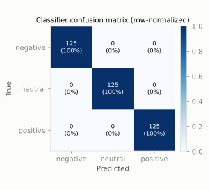
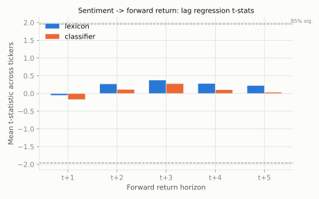
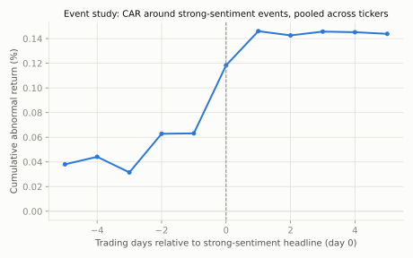
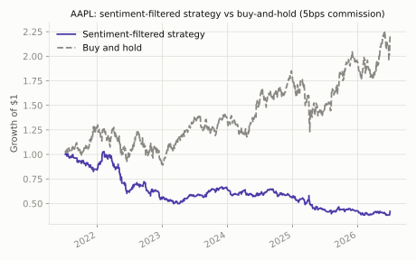

# Sentiment Market Signals

Does financial-headline sentiment actually predict stock returns or volatility, or is it
noise that looks meaningful until you control for lag structure and multiple testing? This
project builds a full NLP-to-statistics pipeline — ingest headlines, score sentiment two
different ways, align them to real market data with a strict no-lookahead rule, and then
subject the resulting signal to lag regressions, a volatility test, an event study, and a
costed backtest against buy-and-hold. The honest answer for this dataset, reported plainly
below, is: no reliable predictive value was found — which is itself a common and
publishable finding in this literature, not a failure of the pipeline.

## Important honesty note on the data

**The headline text in this repository is synthetically generated, not scraped news.** A
live financial news archive was not reliably reachable from the environment this was built
in, so `src/sentiment_signals/headlines.py` generates templated positive / negative / neutral
headlines (with vocabulary variation) and attaches them to real tickers and real trading
dates. Headline sentiment is assigned **independently of realized returns** by construction
— this is a deliberate placebo design, not an oversight, so that any "predictive" result
found later would have to come from a genuine pipeline bug rather than the headlines being
secretly informative. The **market price data is real** (see below), and the **pipeline
itself** — ingestion → cleaning → scoring → alignment → statistical testing — is the actual
deliverable. Point `generate_market_headlines` at a real feed (a news API, or a static
labeled set like the [Financial PhraseBank](https://huggingface.co/datasets/takala/financial_phrasebank))
and the rest of the code is unaffected.

## Data sources

- **Prices**: real daily OHLCV history for `AAPL`, `MSFT`, `TSLA`, `JPM`, `XOM`, pulled from
  stockanalysis.com's public JSON history endpoint (`src/sentiment_signals/market_data.py`).
  Stooq's CSV endpoint — the original intended source — now sits behind a JavaScript
  proof-of-work bot check and is not reachable from a plain HTTP client, so this project
  uses stockanalysis.com's endpoint instead, which serves the same kind of real,
  unauthenticated daily bars.
- **Headlines**: synthetic, as described above.

## Methodology

1. **Sentiment scoring, two ways** (`lexicon.py`, `classifier.py`):
   - A hand-built finance lexicon: counts positive/negative finance terms per headline (with
     a simple negation flip), scores in `[-1, 1]`. No downloads, fully inspectable.
   - A TF-IDF + Logistic Regression classifier trained on a synthetically-labeled corpus of
     1,500 headlines (500/class), evaluated on a held-out 25% test split. A continuous score
     is `P(positive) - P(negative)`.
   - **Documented upgrade path**: swapping in [FinBERT](https://huggingface.co/ProsusAI/finbert)
     (`transformers`, `ProsusAI/finbert`) is a drop-in replacement behind the same
     `.predict_label` / `.score` interface — not implemented here because this sandbox
     cannot reliably download multi-hundred-MB model weights.
2. **No-lookahead alignment** (`alignment.py`): a single function, `build_lagged_dataset`,
   performs all forward-shifting internally from raw same-day-dated series. It rejects
   non-positive horizons and unsorted indices, so a caller cannot construct a same-day or
   backward pairing through it — see `tests/test_alignment.py` for direct tests of this,
   including a demonstration that a naively pre-shifted ("already leaked") feature produces
   a detectably different, wrong alignment.
3. **Lag regressions** (`lag_regression.py`): OLS of the forward return over horizons
   t+1..t+5 on day-t sentiment, with Newey-West (HAC) standard errors to account for the
   overlapping-window autocorrelation that horizons > 1 induce.
4. **Volatility regression** (`volatility.py`): OLS of next-day realized volatility (a
   trailing rolling std of returns) on day-t `|sentiment|` and same-day sentiment dispersion
   across headlines.
5. **Event study** (`event_study.py`): for each ticker, a market model (`ticker_ret = alpha +
   beta * market_ret`, using the equal-weighted average of the *other* four tickers as the
   market proxy) gives an abnormal-return series; strong-sentiment events are days in the
   85th+ percentile of `|mean daily sentiment|`; abnormal returns are averaged across all
   events in a ±5 trading-day window and pooled across tickers.
6. **Backtest** (`backtest.py`): a 3-day trailing mean of daily sentiment (0 on no-headline
   days) drives a long/flat/short position, decided from the *prior* day's close (never
   same-day), with a 5bps commission charged on position changes, compared to buy-and-hold.
7. **Dashboard** (`dashboard.py`): a static HTML page listing headlines next to the day's
   return and close price for a chosen ticker/date window.

## Install & usage

```bash
python3 -m venv .venv
source .venv/bin/activate
pip install -e .
pytest -q                        # run the test suite
python scripts/run_pipeline.py   # fetch real prices, run the full analysis, write charts
```

`scripts/run_pipeline.py` fetches live prices over the network; everything else
(`pytest -q`) runs offline against synthetic/toy data.

## Results

All numbers below are from an actual run of `scripts/run_pipeline.py` against 5 years of
real daily data (2021-07-02 to 2026-07-02, 1,255 trading days) for `AAPL`, `MSFT`, `TSLA`,
`JPM`, `XOM`, with 4,351 synthetic headlines generated across that window. Full CSVs are in
`reports/`.

### Classifier vs majority-class baseline

| Metric | Value |
|---|---|
| Test accuracy | 1.000 |
| Macro F1 | 1.000 |
| Majority-class baseline accuracy | 0.333 |
| Train / test size | 1,125 / 375 |



The classifier hits 100% test accuracy — expected and not very impressive on its own
merits: the synthetic templates use largely disjoint, low-ambiguity vocabulary per class, so
this mainly confirms the pipeline (TF-IDF → Logistic Regression → eval) is wired correctly,
not that the model would generalize to messy real headlines. See Limitations.

### Lag regressions: does day-t sentiment predict forward returns?

Mean OLS coefficient and t-statistic across the 5 tickers, forward return horizons t+1
through t+5, HAC standard errors:

| Horizon | Lexicon coef | Lexicon t-stat | Classifier coef | Classifier t-stat |
|---|---|---|---|---|
| t+1 | -0.00026 | -0.05 | -0.00035 | -0.17 |
| t+2 | 0.00006 | 0.27 | -0.00005 | 0.11 |
| t+3 | 0.00040 | 0.37 | 0.00046 | 0.27 |
| t+4 | 0.00044 | 0.28 | 0.00028 | 0.10 |
| t+5 | 0.00015 | 0.22 | -0.00019 | 0.03 |



No horizon for either scorer comes close to the ±1.96 significance band. This is the
expected result given the placebo headline design, and it means the pipeline is not
manufacturing a false-positive signal out of noise.

### Volatility regression

Across all 5 tickers x 2 scorers (10 regressions, `reports/volatility_regressions.csv`),
`|sentiment|` t-statistics range from -1.60 to 1.78 and are never significant at 5% (AAPL's
classifier regression comes closest, p=0.075). Sentiment *dispersion* is nominally
significant (|t| > 2, p < 0.05) for 2 of 10 regressions (TSLA-lexicon, p=0.010;
TSLA-classifier, p=0.011) — with 10 tests run at a 5% level, 2 "significant" hits by chance
alone is close to the expected false-positive rate under the null, not strong evidence of a
real dispersion effect; no correction for multiple comparisons was applied, and this is
flagged rather than presented as a discovery.

### Event study



Pooled cumulative abnormal return across ~2,370 strong-sentiment events per relative day
moves from about 0.04% five days before the event to about 0.14% five days after — a
drift of roughly 0.10 percentage points, on abnormal returns whose daily standard deviation
is on the order of 1-2%. That is well within noise for a sample this size and should not be
read as an event effect; it is also a useful illustration of how overlapping event windows
(the same handful of tickers contribute thousands of overlapping ±5-day windows) can
produce a smooth-looking drift in a pooled CAR series even when nothing informative is
happening, which is why the raw AAR-per-day table (`reports/event_study_pooled.csv`) is
worth checking alongside the CAR chart.

### Backtest: sentiment-filtered strategy vs buy-and-hold (5bps commission)

| Ticker | Strategy total return | Strategy Sharpe | Buy-and-hold total return | Buy-and-hold Sharpe |
|---|---|---|---|---|
| AAPL | -58.0% | -0.76 | +120.5% | 0.62 |
| MSFT | -33.1% | -0.36 | +40.6% | 0.26 |
| TSLA | +34.4% | 0.14 | +73.9% | 0.20 |
| JPM | +101.8% | 0.80 | +114.4% | 0.67 |
| XOM | +60.6% | 0.48 | +117.0% | 0.63 |



Buy-and-hold beats the sentiment-filtered strategy on **all 5 of 5 tickers**, often by a
wide margin. This is the honest result and is consistent with the lag regressions above: a
signal with no measurable predictive power should not be expected to produce a strategy that
beats the market net of costs, and it doesn't.

## Limitations & next steps

- **Headlines are synthetic and independent of returns by design.** The statistical
  machinery here is real and correctly wired (see `tests/`), but it has not yet been pointed
  at real news text. The most valuable next step is swapping `generate_market_headlines` for
  a real feed or a labeled dataset like Financial PhraseBank.
- **The classifier's 100% accuracy is an artifact of templated, low-ambiguity vocabulary**,
  not evidence the model would work on real headlines, which are noisier, sarcastic,
  multi-topic, and often sentiment-ambiguous. FinBERT (documented in `classifier.py`) is the
  natural upgrade for real text.
- **Multiple testing was not corrected for** in the volatility regressions (10 tests) or
  across the 5-horizon lag grid; the handful of nominally significant p-values reported above
  are flagged as likely false positives rather than findings, exactly the rate you'd expect
  under the null.
- **The event-study market model excludes only the event ticker's own return, not a true
  independent market index** — it uses an equal-weighted average of the other 4 tickers in a
  5-ticker universe, which is a simplification; a broad index (e.g. total market ETF) would
  be a more standard market proxy.
- **The backtest uses one fixed rule** (3-day trailing mean, 70th/30th percentile
  thresholds, 5bps commission) per ticker; it is not tuned or cross-validated, which is
  appropriate for an honest report but means the specific thresholds are illustrative, not
  optimized.

## Repository layout

```
src/sentiment_signals/   importable package (market_data, headlines, lexicon, classifier,
                          alignment, lag_regression, volatility, event_study, backtest,
                          dashboard)
tests/                    pytest suite (46 tests)
scripts/run_pipeline.py   end-to-end run: fetch data, score, test, backtest, render charts
reports/                  CSV outputs and the HTML dashboard from the last real run
docs/img/                 SVG charts embedded above
```
